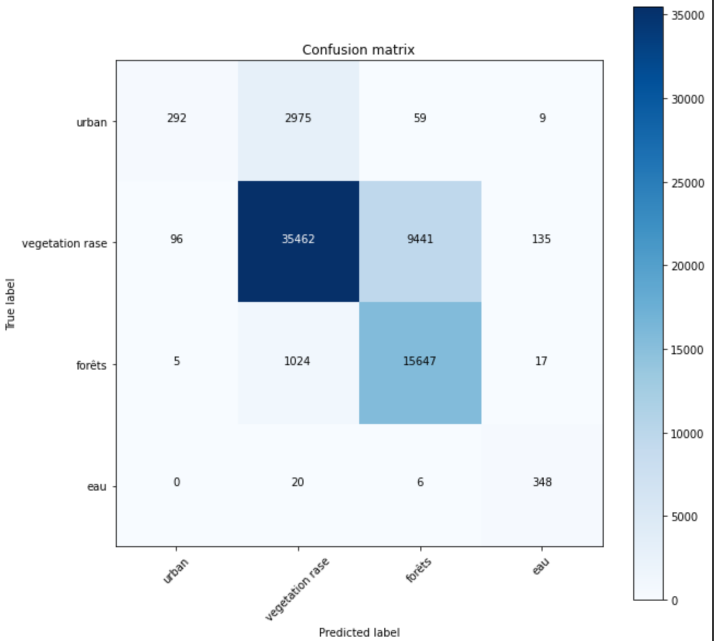

# EI-Soil-Classification


## 📖Présentation

Enseignement d'intégration: développement d'une intelligence artificielle qui permet la classification des sols.  

L'objectif est, pour une image satellite donnée, de pouvoir classifier les différentes zones en plusieurs catégories, dont notamment eau, zone urbaine, forêt dense, forêt peu dense, champs, etc...  

Nous avons utilisé pour cela de l'intelligence artificielle (AI) : plusieurs algorithmes de Machine Learning (ML) ainsi qu'un peu de Deep Learning.

## ⚙️Installation

Pour une première utilisation, vous devrez installer les modules avec:

```
pip install -r requirements.txt
```

## Arborescence du répertoire

Voici l'arborescence du répertoire après avoir cloné le projet

## 🏗️Contributeurs au projet

-Arthur MOL  
-Bastien LI  
-Manon Arfib  
-Alexandre GRAVEREAUX  

## 🚀Exemples de résultats

Masque réel à gauche et masque généré à droite


On obtient la matrice de confusion suivante



## Licence du projet

Creative Commons CC-BY-NC-SA
